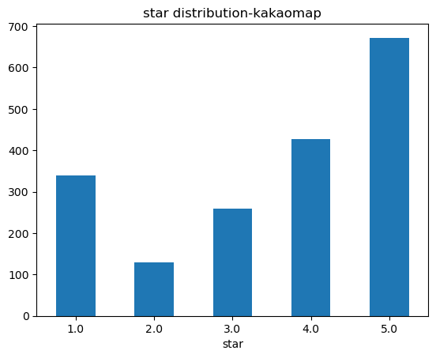
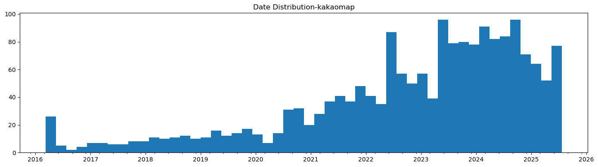
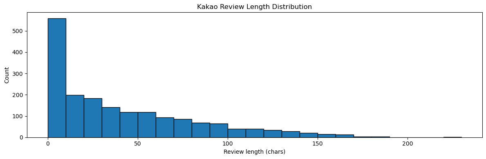
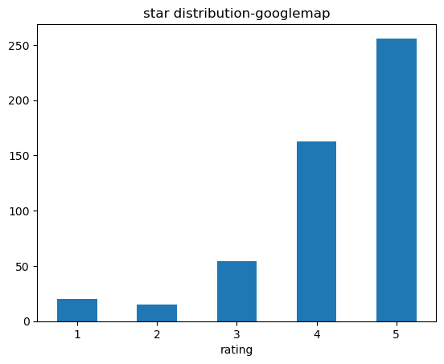
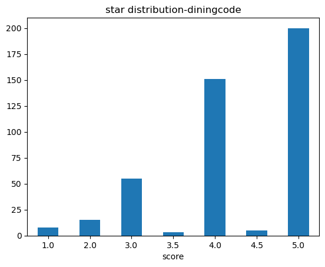
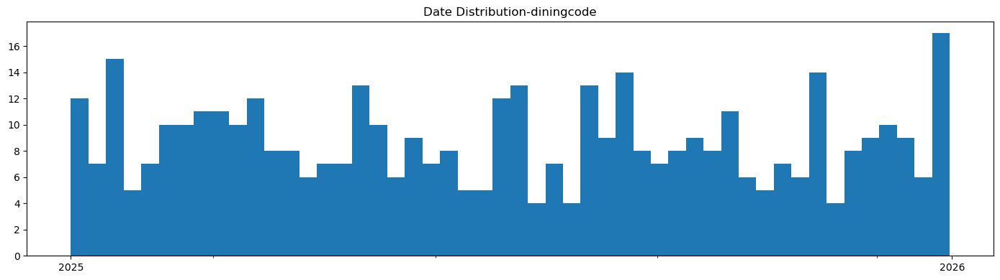
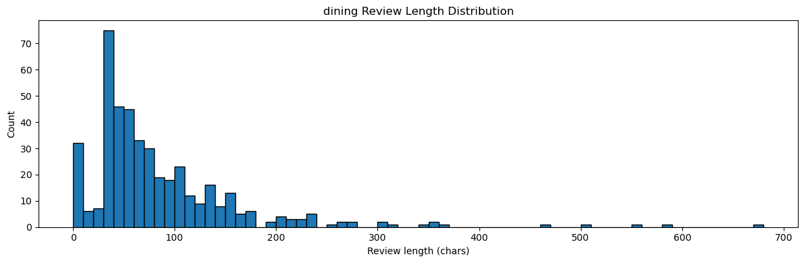

YBIGTA TEAM 7
=============

# about Team

팀 과제 7조입니다. 화이팅!

# Team members

목동현(조장):

박용우: 안녕하세요! 산업공학과 21학번 박용우입니다.

김우진: 인공지능학과 24학번 김우진입니다. 열심히 하겠습니다.

# project

###  코드 실행 방법

#### web 실행 방법

requirements 설치 후 프로젝트 루트에서 uviorn app.main:app --reload 명렁어를 실행하고,

http://127.0.0.1.8000 URL로 접속합니다.

#### Crawling 실행 방법

YBIGTA_newbie_team_project/review_analysis/crawling 까지 이동 후

python main.py -o ../../database --all 로 실행합니다.

#### EDA/FE 실행 방법

주의: konlpy 를 사용하기 위해 컴퓨터에 JAVA가 설치되어 있어야 합니다!

YBIGTA_newbie_team_project/review_analysis/preprocessing 까지 이동 후 ,

python3 main.py -o "../../database" -a 로 실행합니다. 

### project result

#### Github 

깃허브 사진들 올리기 

#### Crawling

명동교자 본점에 대해 리뷰 크롤링을 진행하였습니다.

데이터 형식: <날짜, 별점, 리뷰> 형태의 csv 파일로 수집하였습니다.

links

Google maps:  https://www.google.com/maps/place/명동교자+본점/                     (총 508개)                          

KaKaoMaps: https://place.map.kakao.com/10332413#comment                          (총 1040개)

Diningcode:  https://www.diningcode.com/profile.php?rid=L4miF0diqkcW               (총 437개)

#### EDA 

kakaomap

카카오맵 리뷰의 경우, 별점 5점, 4점의 긍정적인 리뷰가 많았다, 그러나, 1점 리뷰 또한 약 300개 가량의 큰 비율을 차지했다.

리뷰 일자는 대체로 최근의 데이터가 많았다, 이는 최근 "명동교자"의 인기가 늘어난 것으로 해석 할 수도 있으나, 카카오맵 플랫폼의 인기 자체가 최근 높아져 리뷰 수가 증가한 영향으로 명동교자의 리뷰 수 또한 늘어났을 가능성도 있다.

리뷰가 존재하지 않는, 리뷰의 길이가 0인 데이터가 상당히 많은 것을 확인할 수 있다. 이를 결측치로 처리하는 것이 필요해보인다.

googlemap

구글맵의 평점은 5점이 대부분인 것으로 나타났다. 카카오맵과는 달리 1,2점 리뷰가 적었다.

Diningcode

다이닝코드의 별점의 경우, 5점과 3점의 비중이 높았다.

다이닝 코드의 리뷰 일자 분포는 대체적으로 고르게 분포하는 양상을 보였다. 

대체적으로 리뷰 글자 수가 0~200자 사이에서 분포하는 것을 알 수 있다. 200자가 넘는 것은 텍스트 처리의 원활성을 위해 이상치로 처리하는 것이 좋아보인다.

#### 전처리/FE

식당의 평점에 영향을 끼치는 것이 무엇일 지 고민해 본 결과, 요일에 따른 손님의 수로 인한 업무 강도, 계절에 따른 음식의 선호도 변화가 큰 영향을 끼친다고 생각했습니다.
따라서, 요일, 월, 주말 여부를 FE를 통해 분리하고자 했습니다.

전처리(공통): 날짜, 리뷰, 별점  중 하나라도 가지지 못한 데이터들은 모두 제거하였습니다. 또한, 별점 범위(1~5)를 벗어나는 이상치들을 제거하였습니다.  
텍스트 처리를 어렵게 만드는 특수 문자를 제거하기 위해, 한글과 숫자를 제외한 문자들에 대하여 필터링을 진행하였습니다.

kakaomap, Diningcode: 요일, 월, 주말 여부를 추가하였습니다.

googlemap: 구글 맵의 날짜 데이터는 상대 시간(3달 전) 으로 표기되므로, 우선 이 상대 시간으로 부터 절대 시간을 추측하였습니다.
추측한 절대 시간을 바탕으로, 월과 년을 추측하는 FE를 진행하였습니다. 요일과 주말 여부는 너무 부정확성이 큰 관계로 추가하지 않았습니다.

<텍스트 벡터화>

리뷰들의 토픽들을 알아보기 위해, 텍스트를 BOW 방식으로 벡터화한 다음 LDA를 진행하였습니다.

결과는 다음과 같습니다.

[LDA-다이닝코드 시각화 보러가기](review_analysis/plots/lda_visualization_dining.html)  
[LDA-구글맵 시각화 보러가기](review_analysis/plots/lda_visualization_google.html)  
[LDA-카카오맵 시각화 보러가기](review_analysis/plots/lda_visualization_kakao.html)

대체적으로 칼국수, 명동, 만두, 김치 등 음식에 관한 topic이 많음을 확인 할 수 있습니다. 그러나, 벌레 등 부정어 또한 존재하는 것을 확인 할 수 있습니다.

#### 비교분석

